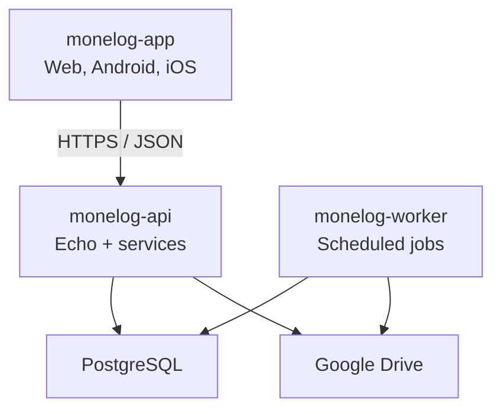

# Monelog backend architecture

Status: Draft for review  
Date: 2026-09-08  
Repository: `monelog-api`  
Related requirements: [requirements.md](requirements.md)

## 1. Purpose

This document defines the initial architecture of the Monelog backend. Monelog is a modular Go application that provides authentication, categories, financial transactions, simple reports, Excel/PDF exports, and Google Drive backup and restore for the Vue application.

The first release uses one deployable API and one deployable background worker backed by the same PostgreSQL database. They share application packages and can initially run from the same codebase.

## 2. Technology decisions

| Area | Decision | Reason |
|---|---|---|
| Language | Go | Strong typing, simple deployment, and existing developer experience |
| HTTP framework | Echo | Routing and middleware with a small API surface |
| Database | PostgreSQL | Transactions, constraints, indexing, and reliable financial persistence |
| Database access | sqlc | Typed Go code generated from reviewed SQL |
| API contract | OpenAPI with oapi-codegen | Contract-first handlers and generated request/response types |
| Authentication | Short-lived JWT access tokens plus database-backed refresh sessions | Fast authenticated requests with revocation and session management |
| Migrations | Versioned SQL migrations | Reproducible database changes |
| Frontend | Vue 3 with JavaScript and Capacitor in `monelog-app` | Shared web, Android, and iOS interface |
| Backup destination | Google Drive application-data folder | Private app-specific user backups |
| Background processing | PostgreSQL-backed jobs processed by a Go worker | Durable backup/export tasks without adding another infrastructure service initially |
| Architecture style | Modular monolith | Keeps deployment and transactions simple while preserving module boundaries |

Exact library versions will be pinned during the foundation issue.

## 3. System context



The API is the only component accessed directly by the frontend. PostgreSQL is not exposed publicly. The worker claims durable jobs from PostgreSQL and performs scheduled backups. Manual backup requests enter the same job pipeline.

## 4. Repository layout

```text
monelog-api/
├── api/
│   └── openapi.yaml
├── cmd/
│   ├── api/
│   │   └── main.go
│   └── worker/
│       └── main.go
├── db/
│   ├── migrations/
│   └── queries/
├── docs/
│   ├── requirements.md
│   ├── architecture.md
│   ├── database.md
│   ├── api.md
│   └── roadmap.md
├── internal/
│   ├── auth/
│   ├── backup/
│   ├── category/
│   ├── config/
│   ├── database/
│   ├── export/
│   ├── httpapi/
│   ├── platform/
│   ├── report/
│   └── transaction/
├── generated/
│   ├── api/
│   └── db/
├── .env.example
├── go.mod
├── sqlc.yaml
└── README.md
```

Business modules contain their service logic. Generated OpenAPI and sqlc code stays separate from handwritten code. Generated code is reproducible from committed OpenAPI, migrations, queries, and generator configuration.

## 5. Request flow

A normal authenticated request follows this sequence:

1. Echo receives the request and applies request ID, recovery, security headers, body-size, timeout, and logging middleware.
2. The generated OpenAPI layer parses the request and enforces contract-level shapes.
3. Authentication middleware verifies the JWT signature, issuer, audience, expiry, and token type.
4. The handler converts HTTP input into a service command.
5. The service enforces business rules and calls typed sqlc queries.
6. PostgreSQL applies ownership, foreign-key, uniqueness, and value constraints.
7. The handler maps the result to the standard API response or problem format.
8. Logs include the request ID and safe metadata without credentials or financial notes.

Handlers do not contain SQL or substantial business rules. Services do not depend on Echo request/response objects.

## 6. Module responsibilities

| Module | Responsibility |
|---|---|
| `auth` | Registration, password verification, access tokens, refresh rotation, logout, session revocation |
| `category` | User categories, type compatibility, rename, archive |
| `transaction` | Create, list, view, edit, delete, idempotency |
| `report` | Period validation and exact income/expense/category totals |
| `export` | Authorized Excel and PDF generation using report rules |
| `backup` | Google authorization metadata, scheduling, snapshots, retention, restore |
| `httpapi` | Generated server interface adapters, middleware, error mapping |
| `database` | Pool creation, transaction helpers, generated query access |
| `config` | Environment configuration and startup validation |
| `platform` | Clock, identifiers, encryption interfaces, external API clients |

Dependencies point inward: HTTP and external adapters call application services; services use narrow database/external interfaces.

## 7. API contract and code generation

`api/openapi.yaml` is the authoritative HTTP contract.

The development sequence is:

1. Update the OpenAPI contract.
2. Review request, response, validation, security, and error behavior.
3. Run oapi-codegen to regenerate Go server interfaces and models.
4. Implement or update the handwritten handler adapter.
5. Run generation checks and tests.

The OpenAPI generator configuration and pinned tool version are committed. CI regenerates into a temporary location or checks the working tree to detect stale generated code.

The JavaScript frontend consumes the published OpenAPI contract. A generated JavaScript client may be added later, but frontend work must not depend on TypeScript.

## 8. Database access and transactions

SQL lives in `db/queries`; sqlc generates typed access code into `generated/db`.

Rules:

- Every user-owned query includes the authenticated `user_id` in its predicate.
- Services never accept a client-supplied owner ID as the source of authorization.
- Money uses an exact database representation defined in `database.md`; Go code must not use `float32` or `float64` for stored amounts or totals.
- Multi-step writes use PostgreSQL transactions.
- List queries use bounded pagination and stable ordering.
- Report totals and report detail rows use the same normalized filter rules.
- Database constraints remain the final defense for invalid relationships and values.
- Migrations are forward-only in deployed environments; recovery uses tested database backups.

## 9. Authentication and session design

Monelog uses two token types:

| Token | Purpose | Proposed lifetime |
|---|---|---|
| Access JWT | Authorize API requests | 15 minutes |
| Refresh token | Obtain a new access token | 30 days maximum session lifetime |

These lifetimes are architecture defaults to review before implementation.

Access JWT claims include subject (user ID), issuer, audience, issued-at, expiry, unique token ID, and token type. Signing keys come from secret configuration and support key identification for rotation.

Refresh tokens are random opaque secrets. The database stores only a cryptographic hash, together with session family, expiry, creation, last-use, revocation, and client metadata. Refresh rotates the token. Reuse of an already-rotated token revokes its session family.

For the web client, the preferred delivery is a Secure, HttpOnly, SameSite cookie for the refresh token, with CSRF protection where required. Native clients store refresh credentials using operating-system secure storage. The access token is kept in memory where practical.

Password hashing parameters, email verification, password recovery, account deletion, concurrent-session limits, and key-rotation operations will be finalized in the authentication issue.

## 10. Authorization and privacy boundary

The authenticated user ID comes from validated server-side authentication context. It is passed explicitly through the service and query layers.

Required controls:

- Ownership checks apply to categories, transactions, report filters, exports, backup settings, backup files, and restore.
- Missing and inaccessible user-owned resources return behavior that does not reveal another user's data.
- Export and backup download identifiers are opaque and scoped to the user.
- Logs never include passwords, tokens, Google credentials, complete exported data, or transaction titles by default.
- Database credentials, JWT signing material, Google OAuth secrets, and encryption keys come from secret configuration.

## 11. Reports and exports

A shared report service owns date-range normalization, currency rules, totals, category grouping, and transaction filtering. The on-screen report, Excel export, and PDF export call this same logic to avoid different totals.

Initial reports are simple:

- income;
- expenses;
- difference;
- category totals;
- matching transaction details.

Small exports may be generated during the HTTP request with strict time and row limits. The detailed API design will define the threshold at which export generation becomes a background job. Generated files have a short retention period and an authorized download endpoint.

## 12. Google Drive backup architecture

Users authorize Google Drive separately from Monelog authentication. The backend handles the OAuth authorization-code callback and protects stored refresh credentials using authenticated encryption with a deployment-managed key.

Backup flow:

1. The scheduler finds due enabled backup settings.
2. It inserts or claims a unique backup job for the user and scheduled time.
3. The worker reads a consistent snapshot of that user's categories, transactions, and allowed preferences.
4. It creates a versioned manifest and compressed JSON archive.
5. It computes integrity metadata and uploads the archive to the user's Drive application-data folder.
6. It records success and remote file metadata.
7. It applies retention only after upload success.
8. Temporary failures retry with bounded exponential backoff; authorization failures require reconnection.

Manual backup creates the same durable job and returns its status identifier.

Only one backup or restore operation may modify a user's backup state at a time. PostgreSQL locking and unique constraints enforce this across multiple workers.

## 13. Restore architecture

Restore is an explicit, auditable operation:

1. List backup metadata for the authenticated user's connected Drive.
2. Download the selected archive into bounded temporary storage.
3. Verify size, checksum, schema version, record counts, and relationships.
4. Create a pre-restore backup.
5. Acquire a user-level restore lock.
6. Replace that user's restorable financial data in one database transaction.
7. Verify counts and totals before commit.
8. Record the result and refresh frontend data.

The restore process assigns the authenticated user as owner and never trusts owner identifiers from the archive. New transaction writes for that user are rejected or briefly paused while restore holds the lock.

The encryption and user key-recovery model remains an open decision. Backup implementation cannot begin until it is documented.

## 14. Background jobs

The first version uses PostgreSQL as the durable job store to limit operational dependencies.

Each job records:

- type and user;
- state;
- scheduled and available time;
- attempt count;
- locked worker and lease expiry;
- idempotency key;
- safe error category;
- created, started, and completed timestamps.

Workers claim jobs using transactional row locking with skip-locked behavior, renew leases for long work, and recover expired leases. Job handlers must be idempotent. Failed jobs retain enough safe metadata for diagnosis without storing secrets.

## 15. Configuration and environments

Configuration is read at startup and validated before serving traffic.

Expected groups:

- server address, public API URL, allowed frontend origins;
- PostgreSQL connection and pool settings;
- JWT issuer, audience, signing keys, active key ID;
- encryption key reference;
- Google OAuth client configuration and redirect URL;
- backup scheduling, retry, file-size, and retention limits;
- export size and retention limits;
- log level and environment name.

Local values use an uncommitted `.env`; `.env.example` contains names and safe placeholders. Staging and production obtain secrets from the hosting environment's secret facility.

## 16. Reliability and observability

- Every request and job has a correlation ID.
- Structured logs record operation, duration, status, and safe identifiers.
- Health endpoints distinguish process liveness from dependency readiness.
- Metrics cover request latency/errors, database pool health, job queue age, backup success/failure, and export duration.
- API and worker shut down gracefully.
- HTTP and external calls use explicit timeouts.
- Database and Google Drive failures return stable error categories.
- Operational PostgreSQL backups are scheduled and restore-tested independently of personal Drive backups.

Tracing can be added after measurements show it is useful.

## 17. Testing strategy

| Level | Focus |
|---|---|
| Unit | Business rules, date ranges, token rules, backup manifest validation |
| Database integration | Migrations, constraints, sqlc queries, ownership, locking, totals |
| HTTP integration | OpenAPI handlers, authentication, error format, pagination |
| External adapter | Google Drive behavior through a controlled fake server/client |
| End-to-end | Register, transact, report, export, back up, restore |

High-value tests include cross-user access, refresh-token reuse, exact financial totals, timezone boundaries, duplicate transaction submissions, report/export parity, worker lease recovery, corrupt backups, and failed restore rollback.

## 18. Deployment shape

Initial production deployment contains:

- one or more stateless API processes;
- one or more worker processes;
- managed PostgreSQL;
- HTTPS ingress;
- secret management;
- durable operational database backups.

API and worker use the same released application version so job payload and schema expectations remain compatible. Database migrations run once as a controlled release step before incompatible application changes.

## 19. Architecture decisions still open

These decisions must be resolved in later planning documents or their implementation issues:

1. Exact money scale and maximum amount.
2. User timezone editing and supported values.
3. Password recovery, email verification, and account deletion scope.
4. JWT signing algorithm and production key-rotation procedure.
5. CORS, cookie domain, and CSRF rules for the final web hosting domains.
6. Backup encryption and recovery model.
7. Export synchronous limits and background-job threshold.
8. PostgreSQL migration tool.
9. Hosting providers and service limits.
10. Data retention and user privacy policy.

## 20. Architecture acceptance criteria

This architecture is accepted when:

- it remains consistent with `requirements.md`;
- module and repository responsibilities are clear;
- user ownership is enforced through every data path;
- exact money and timezone handling are delegated to explicit database/API decisions;
- report and export calculations share one rule set;
- backup jobs survive app/API restarts;
- restore has validation, locking, rollback, and recovery;
- remaining decisions are visible and assigned before implementation.
