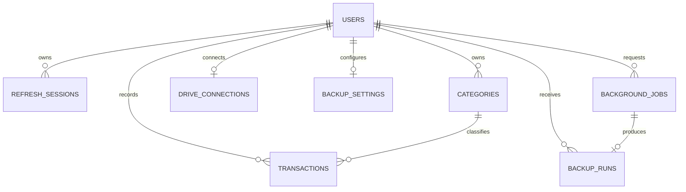

# Monelog database design

Status: Draft for review  
Date: 2026-09-08  
Database: PostgreSQL  
Repository: `monelog-api`  
Related documents: [requirements.md](requirements.md), [architecture.md](architecture.md)

## 1. Purpose

This document defines the initial PostgreSQL data model for Monelog. It covers users, refresh sessions, categories, transactions, Google Drive connections, backup settings, durable background jobs, and backup history.

The design follows the existing `monelog-be` concepts for users, categories, and transactions, then adds the constraints and records required by the accepted Monelog requirements.

## 2. Main decisions

| Topic | Decision |
|---|---|
| Primary keys | `BIGINT GENERATED ALWAYS AS IDENTITY` for main records; UUID for public job and session identifiers |
| Currency | IDR only in version 1 |
| Money storage | Whole rupiah stored as positive `BIGINT`; no floating-point values |
| Transaction sign | `type` determines income or expense; `amount` is always positive |
| Business date | PostgreSQL `DATE` in the user's configured timezone |
| Audit timestamps | `TIMESTAMPTZ`, stored in UTC |
| User deletion | Soft deletion for users |
| Category deletion | Archive categories so historical transactions remain readable |
| Transaction deletion | Soft deletion with deletion timestamp |
| Ownership | User ID appears in user-owned tables and queries; composite foreign keys enforce category ownership |
| JWT logout | Database-backed refresh sessions replace the old access-token blacklist |
| Background jobs | PostgreSQL table with leasing and idempotency |
| Drive credentials | Encrypted token ciphertext; plaintext tokens are never stored |
| Reports | Calculated from transactions; no duplicated summary table initially |

### Money rule

Version 1 accepts whole IDR values from `1` through `9,000,000,000,000,000` rupiah. For example:

| Display | Stored value |
|---|---:|
| Rp10.000 | `10000` |
| Rp769.500 | `769500` |

The API transports money as a decimal string to avoid JavaScript precision and formatting mistakes. PostgreSQL and Go use integer values. If multi-currency or fractional currencies are introduced later, this decision requires a migration and contract version review.

## 3. Entity relationships



## 4. Tables

### 4.1 users

Stores Monelog account identity and preferences.

| Column | Type | Rules |
|---|---|---|
| `id` | BIGINT | Primary key, identity |
| `email` | VARCHAR(320) | Required; unique case-insensitively |
| `password_hash` | TEXT | Required |
| `name` | VARCHAR(100) | Required |
| `timezone` | VARCHAR(64) | Required; default `Asia/Jakarta` |
| `locale` | VARCHAR(10) | Required; default `id-ID` |
| `created_at` | TIMESTAMPTZ | Required; default current time |
| `updated_at` | TIMESTAMPTZ | Required; application updates it |
| `deleted_at` | TIMESTAMPTZ | Null while active |

Use a unique index on `lower(email)` for active and deleted users unless product policy later allows re-registering a deleted address. Version 1 reserves an email permanently to avoid account takeover through reuse.

User-facing queries include `deleted_at IS NULL`.

### 4.2 refresh_sessions

Stores hashed opaque refresh tokens and supports rotation, logout, reuse detection, and session revocation.

| Column | Type | Rules |
|---|---|---|
| `id` | UUID | Primary key |
| `user_id` | BIGINT | Required; references users |
| `family_id` | UUID | Required; groups rotated tokens |
| `token_hash` | BYTEA | Required; unique |
| `parent_id` | UUID | Optional self-reference to prior rotated token |
| `created_at` | TIMESTAMPTZ | Required |
| `last_used_at` | TIMESTAMPTZ | Optional |
| `expires_at` | TIMESTAMPTZ | Required |
| `rotated_at` | TIMESTAMPTZ | Optional |
| `revoked_at` | TIMESTAMPTZ | Optional |
| `revoke_reason` | VARCHAR(50) | Optional |
| `user_agent` | VARCHAR(500) | Optional, truncated |
| `ip_address` | INET | Optional |

A refresh session is usable only when it is unexpired, unrevoked, and not already rotated. A detected reuse revokes every active row with the same `family_id`.

Indexes:

- `(user_id, created_at DESC)`
- `(family_id) WHERE revoked_at IS NULL`
- `(expires_at)` for cleanup

### 4.3 categories

Stores an individual user's income and expense categories.

| Column | Type | Rules |
|---|---|---|
| `id` | BIGINT | Primary key, identity |
| `user_id` | BIGINT | Required; references users |
| `name` | VARCHAR(100) | Required; trimmed and non-empty |
| `type` | VARCHAR(10) | `income` or `expense` |
| `created_at` | TIMESTAMPTZ | Required |
| `updated_at` | TIMESTAMPTZ | Required |
| `archived_at` | TIMESTAMPTZ | Null while selectable |

Constraints and indexes:

- unique `(id, user_id)` to support the transaction ownership foreign key;
- unique active category name per user and type using `(user_id, lower(name), type) WHERE archived_at IS NULL`;
- index `(user_id, type, name)` for category selection.

Archived categories remain linked to historical transactions.

### 4.4 transactions

Stores each income or expense entry.

| Column | Type | Rules |
|---|---|---|
| `id` | BIGINT | Primary key, identity |
| `user_id` | BIGINT | Required; references users |
| `category_id` | BIGINT | Required |
| `type` | VARCHAR(10) | `income` or `expense` |
| `amount` | BIGINT | Required; positive, within maximum |
| `title` | VARCHAR(200) | Required; trimmed and non-empty |
| `note` | TEXT | Optional; maximum length enforced by API |
| `transaction_date` | DATE | Required |
| `idempotency_key` | UUID | Required for safe create retries |
| `created_at` | TIMESTAMPTZ | Required |
| `updated_at` | TIMESTAMPTZ | Required |
| `deleted_at` | TIMESTAMPTZ | Null while active |

Foreign keys:

- `user_id -> users(id)`;
- `(category_id, user_id) -> categories(id, user_id)`.

The handler also verifies that the category `type` matches the transaction `type`. A database trigger is avoided initially because it makes sqlc behavior and migrations harder to reason about; the composite ownership relationship remains database-enforced.

Constraints and indexes:

- `amount > 0 AND amount <= 9000000000000000`;
- unique `(user_id, idempotency_key)`;
- `(user_id, transaction_date DESC, id DESC) WHERE deleted_at IS NULL`;
- `(user_id, category_id, transaction_date DESC) WHERE deleted_at IS NULL`;
- `(user_id, type, transaction_date DESC) WHERE deleted_at IS NULL`.

Reports exclude rows where `deleted_at IS NOT NULL`.

### 4.5 drive_connections

Stores one Google Drive authorization connection per user.

| Column | Type | Rules |
|---|---|---|
| `user_id` | BIGINT | Primary key; references users |
| `google_subject` | VARCHAR(255) | Required |
| `google_email` | VARCHAR(320) | Optional display metadata |
| `refresh_token_ciphertext` | BYTEA | Required; authenticated encryption output |
| `encryption_key_id` | VARCHAR(100) | Required |
| `scopes` | TEXT[] | Required |
| `connected_at` | TIMESTAMPTZ | Required |
| `updated_at` | TIMESTAMPTZ | Required |
| `reauthorization_required_at` | TIMESTAMPTZ | Optional |
| `disconnected_at` | TIMESTAMPTZ | Optional |

Do not store access tokens unless a measured need appears; obtain short-lived access tokens from the protected refresh credential. Never log token fields.

### 4.6 backup_settings

Stores the user's automatic-backup preference.

| Column | Type | Rules |
|---|---|---|
| `user_id` | BIGINT | Primary key; references users |
| `enabled` | BOOLEAN | Required; default false |
| `local_time` | TIME | Required; default `02:00:00` |
| `timezone` | VARCHAR(64) | Required; default from user |
| `retention_count` | SMALLINT | Required; default 7; range 1–30 |
| `next_run_at` | TIMESTAMPTZ | Optional while disabled |
| `created_at` | TIMESTAMPTZ | Required |
| `updated_at` | TIMESTAMPTZ | Required |

Enabling backup requires an active `drive_connections` row. This rule is checked transactionally by the handler.

Index `(next_run_at) WHERE enabled = true` supports scheduler polling.

### 4.7 background_jobs

Provides durable execution for scheduled/manual backups, restores, and future large exports.

| Column | Type | Rules |
|---|---|---|
| `id` | UUID | Primary key; safe API identifier |
| `user_id` | BIGINT | Required; references users |
| `type` | VARCHAR(30) | `backup`, `restore`, or `export` |
| `status` | VARCHAR(20) | `queued`, `running`, `succeeded`, `failed`, `cancelled` |
| `payload` | JSONB | Required; versioned, no credentials |
| `idempotency_key` | VARCHAR(200) | Required |
| `attempt_count` | SMALLINT | Required; default 0 |
| `max_attempts` | SMALLINT | Required |
| `available_at` | TIMESTAMPTZ | Required |
| `locked_by` | VARCHAR(100) | Optional |
| `lease_expires_at` | TIMESTAMPTZ | Optional |
| `last_error_code` | VARCHAR(100) | Optional; safe category only |
| `created_at` | TIMESTAMPTZ | Required |
| `started_at` | TIMESTAMPTZ | Optional |
| `completed_at` | TIMESTAMPTZ | Optional |

Constraints and indexes:

- unique `(user_id, type, idempotency_key)`;
- `(status, available_at)` for job claiming;
- `(lease_expires_at) WHERE status = 'running'` for lease recovery;
- `(user_id, created_at DESC)` for status history;
- status/timestamp consistency checks where practical.

Workers claim jobs with a short transaction using `FOR UPDATE SKIP LOCKED`. Payload size is bounded by the application; backup contents are never stored in this table.

### 4.8 backup_runs

Records completed and failed backup attempts and the remote file metadata required for listing and restore.

| Column | Type | Rules |
|---|---|---|
| `id` | UUID | Primary key |
| `user_id` | BIGINT | Required; references users |
| `job_id` | UUID | Required; unique, references background_jobs |
| `drive_file_id` | TEXT | Optional until upload succeeds |
| `backup_version` | SMALLINT | Required |
| `status` | VARCHAR(20) | `running`, `succeeded`, `failed`, `deleted` |
| `trigger` | VARCHAR(20) | `scheduled`, `manual`, `pre_restore` |
| `transaction_count` | BIGINT | Optional |
| `category_count` | BIGINT | Optional |
| `size_bytes` | BIGINT | Optional |
| `checksum_sha256` | CHAR(64) | Optional |
| `started_at` | TIMESTAMPTZ | Required |
| `completed_at` | TIMESTAMPTZ | Optional |
| `deleted_at` | TIMESTAMPTZ | Optional |
| `error_code` | VARCHAR(100) | Optional; safe category only |

Indexes:

- `(user_id, completed_at DESC) WHERE status = 'succeeded'`;
- `(user_id, status, started_at DESC)`.

A successful run must have remote file ID, counts, size, checksum, and completion time. The archive itself stays in Google Drive.

## 5. Representative PostgreSQL schema

This is a planning reference. The implementation migration will be created and reviewed in a separate issue.

```sql
CREATE TABLE users (
    id BIGINT GENERATED ALWAYS AS IDENTITY PRIMARY KEY,
    email VARCHAR(320) NOT NULL,
    password_hash TEXT NOT NULL,
    name VARCHAR(100) NOT NULL CHECK (btrim(name) <> ''),
    timezone VARCHAR(64) NOT NULL DEFAULT 'Asia/Jakarta',
    locale VARCHAR(10) NOT NULL DEFAULT 'id-ID',
    created_at TIMESTAMPTZ NOT NULL DEFAULT now(),
    updated_at TIMESTAMPTZ NOT NULL DEFAULT now(),
    deleted_at TIMESTAMPTZ
);

CREATE UNIQUE INDEX users_email_unique
    ON users (lower(email));

CREATE TABLE categories (
    id BIGINT GENERATED ALWAYS AS IDENTITY PRIMARY KEY,
    user_id BIGINT NOT NULL REFERENCES users(id),
    name VARCHAR(100) NOT NULL CHECK (btrim(name) <> ''),
    type VARCHAR(10) NOT NULL CHECK (type IN ('income', 'expense')),
    created_at TIMESTAMPTZ NOT NULL DEFAULT now(),
    updated_at TIMESTAMPTZ NOT NULL DEFAULT now(),
    archived_at TIMESTAMPTZ,
    UNIQUE (id, user_id)
);

CREATE UNIQUE INDEX categories_active_name_unique
    ON categories (user_id, lower(name), type)
    WHERE archived_at IS NULL;

CREATE TABLE transactions (
    id BIGINT GENERATED ALWAYS AS IDENTITY PRIMARY KEY,
    user_id BIGINT NOT NULL REFERENCES users(id),
    category_id BIGINT NOT NULL,
    type VARCHAR(10) NOT NULL CHECK (type IN ('income', 'expense')),
    amount BIGINT NOT NULL
        CHECK (amount > 0 AND amount <= 9000000000000000),
    title VARCHAR(200) NOT NULL CHECK (btrim(title) <> ''),
    note TEXT,
    transaction_date DATE NOT NULL,
    idempotency_key UUID NOT NULL,
    created_at TIMESTAMPTZ NOT NULL DEFAULT now(),
    updated_at TIMESTAMPTZ NOT NULL DEFAULT now(),
    deleted_at TIMESTAMPTZ,
    FOREIGN KEY (category_id, user_id)
        REFERENCES categories(id, user_id),
    UNIQUE (user_id, idempotency_key)
);
```

The implementation migration must also include refresh, Drive, settings, job, and backup-run tables after the document is accepted.

## 6. Report query rules

All report queries receive the authenticated `user_id`, inclusive `from_date`, and inclusive `to_date`.

Core filter:

```sql
WHERE user_id = $1
  AND transaction_date >= $2
  AND transaction_date <= $3
  AND deleted_at IS NULL
```

Totals use conditional integer sums:

- income: sum of `amount` where `type = 'income'`;
- expense: sum of `amount` where `type = 'expense'`;
- difference: income minus expense.

Use `COALESCE(..., 0)` for empty periods. Category reports join with the same user's category and group by category ID and stored category name. Screen reports and exports use the same query family and filter normalization.

No materialized summary table is needed initially. Add one only after production measurements show report queries require it.

## 7. sqlc organization

SQL source files:

```text
script/sqlc/
├── queries/
│   ├── auth.sql
│   ├── category.sql
│   ├── transaction.sql
│   ├── report.sql
│   └── backup.sql
├── schema/
│   ├── 001_create_users.sql
│   ├── 002_create_finance_tables.sql
│   └── 003_create_backup_tables.sql
└── sqlc.yaml
```

Generated Go files go to `internal/repository/postgresql`.

sqlc query rules:

- include `user_id` in every user-owned read/update/delete;
- avoid `SELECT *` in application queries;
- give every query a stable sqlc name;
- use explicit ordering and bounded limits;
- return affected records for ownership-sensitive updates where useful;
- wrap multi-query operations in a `DBTX`/transaction helper;
- separate generated files from handwritten `connect.go` and transaction helpers.

## 8. Migration rules

- Migration files are immutable after deployment.
- Every schema change has a new ordered migration.
- Run migrations as a controlled release step, once per environment.
- Prefer backward-compatible expand-and-contract changes when API and worker versions may overlap.
- Test a clean migration and migration from the previous released schema.
- Use PostgreSQL advisory locking if the selected migration tool does not prevent concurrent runners.
- Never use destructive automatic schema synchronization in production.
- Restore testing is part of operational database-backup validation.

The exact migration tool remains an architecture choice for the foundation issue.

## 9. Data lifecycle

| Data | Initial lifecycle |
|---|---|
| Expired refresh sessions | Delete after a short operational grace period, proposed 30 days |
| Soft-deleted transactions | Retain until account deletion/privacy policy is finalized |
| Archived categories | Retain while referenced |
| Completed background jobs | Retain status metadata for 30 days |
| Failed job errors | Store safe codes only; retain 30 days |
| Backup-run metadata | Retain while its backup exists, plus short deletion history |
| Disconnected Drive credentials | Remove encrypted credential immediately; retain non-sensitive audit timestamps |
| Deleted users | Disable login immediately; hard-deletion process requires a policy decision |

A scheduled cleanup job applies approved retention rules in bounded batches.

## 10. Concurrency and integrity

- Creating a transaction uses unique `(user_id, idempotency_key)` to prevent duplicate retries.
- Updating or deleting a transaction can use `updated_at` as an optimistic-concurrency precondition in the API.
- Refresh-token rotation locks the current session row before marking it rotated and inserting its replacement.
- Scheduler creation uses a deterministic idempotency key per user and scheduled time.
- Job claiming uses `FOR UPDATE SKIP LOCKED` and a lease expiry.
- Only one backup or restore job for a user may run at once, enforced with a PostgreSQL advisory lock or a dedicated lock row.
- Restore executes inside a database transaction after validation and a pre-restore backup.
- Restore replaces only the authenticated user's restorable rows and never imports source owner IDs.

## 11. Security rules

- Store password hashes, never passwords.
- Store refresh-token hashes, never refresh-token plaintext.
- Encrypt Google refresh credentials using authenticated encryption and an external deployment key.
- Do not put secrets or complete backup data in JSONB job payloads.
- Parameterize every SQL query through sqlc.
- Limit database application permissions; migration credentials may be separate.
- Do not expose sequential database IDs without an authenticated ownership check.
- Exclude token, credential, title, note, and exported financial contents from normal logs.
- Test every user-owned query with a cross-user case.

## 12. Decisions resolved by this document

- Version 1 stores positive whole-rupiah amounts in `BIGINT`.
- Categories are archived rather than hard-deleted after use.
- Transactions are soft-deleted.
- JWT access tokens are not blacklisted; refresh sessions provide logout and revocation.
- Reports are calculated from transactions without summary tables initially.
- PostgreSQL provides the durable job queue for backups, restore, and large exports.
- One active Google Drive connection and one backup setting exist per user.

## 13. Decisions still open

1. Migration tool.
2. Password hashing algorithm and parameters.
3. Email verification, password recovery, and account deletion lifecycle.
4. Whether future transaction dates are permitted.
5. Maximum note length.
6. Final backup encryption and key recovery.
7. Hard-deletion retention policy.
8. Export job/file metadata table if large asynchronous exports enter version 1.

## 14. Database acceptance criteria

This design is accepted when:

- every financial row has enforceable user ownership;
- transaction/category ownership is protected by a composite foreign key;
- money has an exact representation and documented API mapping;
- refresh rotation and revocation can be implemented without an access-token blacklist;
- daily and range reports have supporting indexes and consistent filters;
- scheduled jobs survive restarts and support safe retries;
- Drive credentials can be protected and removed;
- restore can run transactionally for one authenticated user;
- sqlc source and generated-code locations match `architecture.md`;
- remaining product decisions are visible before implementation.
